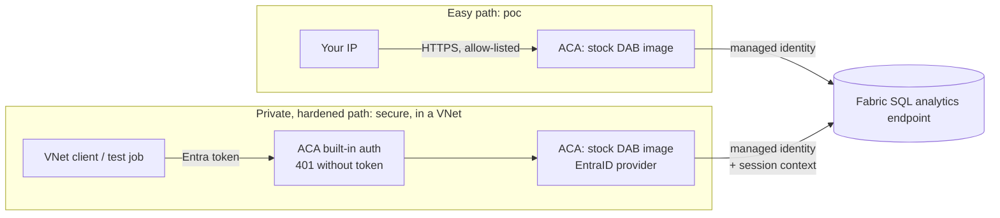
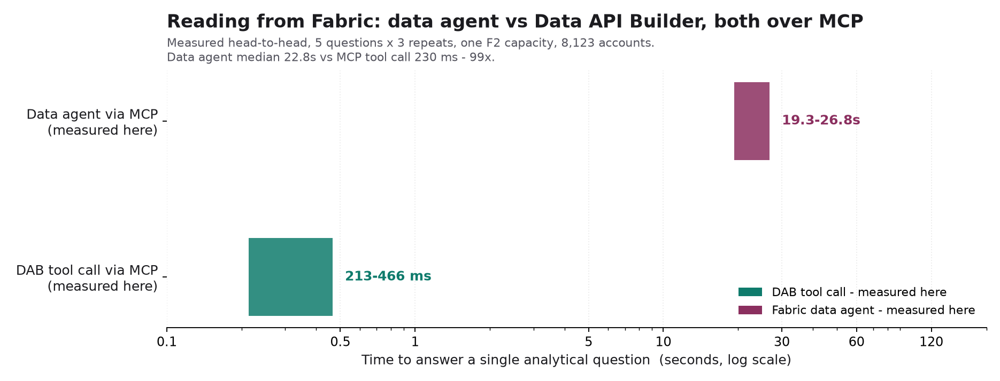

# Fabric Lakehouse over MCP with Data API Builder

Publish curated views from a Microsoft Fabric Lakehouse as a read-only **MCP server** using stock
[Data API Builder](https://learn.microsoft.com/azure/data-api-builder/) (DAB), and deploy it to Azure
Container Apps with one `azd up`.

An agent connected to this endpoint gets three generic tools (`describe_entities`, `read_records`,
`aggregate_records`) over the views you choose to publish. The model fills in arguments and DAB builds
the SQL, so it never writes a query itself. It can only reach published entities and fields, and every
filter goes through OData, not SQL.

This guide covers the whole path:

1. Curate views in the Lakehouse.
2. Generate `dab-config.json` from the SQL analytics endpoint.
3. Run and test it locally.
4. Deploy it to Azure Container Apps on the **easy path** (`poc`) or the **private, hardened path**
   (`secure`).
5. Test the deployed endpoint and connect a client.

The repository ships with a synthetic commercial deposits dataset (`lh_deposits`) as the worked
example. Nothing in the deployment is specific to it.

## Choose a path

There are two deployment paths. Both use the same `dab/dab-config.json`, and one setting chooses
between them: `azd env set DEPLOYMENT_PROFILE poc` or `secure`.

| | Easy path: `poc` | Private, hardened path: `secure` |
| --- | --- | --- |
| Purpose | Prove the pattern against your data | Run it for real users |
| Ingress | Public HTTPS, **IP allow-list** (defaults to your current IP) | **VNet-internal** only |
| Caller auth | None (anonymous read) | **Entra ID** bearer token, checked at the edge (401) and by DAB |
| Who can call | Anyone on an allowed IP | Principals assigned the `Deposits.Read` app role |
| DAB to Fabric | User-assigned managed identity | User-assigned managed identity |
| Row-level security | Not applicable | Session-context RLS driven by the caller's token claims |
| Test from | Your laptop | An ACA Job inside the VNet (deployed for you) |
| Extra resources | None | VNet, private DNS zone, Entra app registration, test job + identity |
| Validated | 13/13 checks through public ingress | 14/14 checks from inside the VNet, including 401 without a token |

In both profiles DAB connects to Fabric as a **managed identity**. There are no passwords, keys or
connection-string secrets anywhere in the deployment.



The DAB container is the unmodified Microsoft image
(`mcr.microsoft.com/azure-databases/data-api-builder`). Your config is delivered as a Container Apps
secret mounted at `/config/dab-config.json`, so there is no image to build or registry to run.

## Prerequisites

| Need | Why |
| --- | --- |
| A Fabric workspace with a Lakehouse (or Warehouse) on a running capacity | The data source |
| Admin or Member on that workspace | To grant the managed identity access |
| Tenant setting **Service principals can call Fabric public APIs** enabled (Fabric admin portal > Tenant settings > Developer settings) | A managed identity is a service principal. Validated with this setting on; restrict it to a security group containing the managed identity if your tenant requires |
| Azure subscription with rights to create a resource group and role assignments | The deployment |
| Secure profile only: permission to create Entra app registrations | The API the callers authenticate against |
| [Azure Developer CLI](https://aka.ms/azd) and [Azure CLI](https://aka.ms/azcli) | Deploy and operate |
| Python 3.11+ and ODBC Driver 18 for SQL Server | Config generator and test scripts |
| .NET 8 SDK and the DAB CLI: `dotnet tool install -g Microsoft.DataApiBuilder --version 2.0.9` | Validate and run DAB locally |

```powershell
pip install -r requirements.txt
az login
azd auth login
copy .env.example .env    # fill in FABRIC_SQL_SERVER and FABRIC_SQL_DATABASE
```

`FABRIC_SQL_SERVER` is the SQL analytics endpoint host: Fabric > workspace > Lakehouse > Settings >
SQL analytics endpoint > SQL connection string. `FABRIC_SQL_DATABASE` is the Lakehouse name.

## Step 1: Curate views

Publish views, not raw tables. A view is where you pre-join dimensions, rename cryptic columns, drop
sensitive fields and precompute awkward logic (for example `days_to_maturity`). The model never sees
your physical schema, only what DAB publishes, so this step decides answer quality more than any
other.

[setup_views.py](setup_views.py) creates the three example views over the synthetic dataset. Use it
as a template for your own.

## Step 2: Generate the DAB config

```powershell
python scripts/generate_dab_config.py --schema dbo --views-only
# or name objects explicitly
python scripts/generate_dab_config.py --object dbo.vw_deposits --object dbo.vw_maturity_ladder
```

The generator reads `INFORMATION_SCHEMA` through the SQL endpoint and writes
[dab/dab-config.json](dab/dab-config.json) with one entity per object. It exists because `dab init`
and `dab add` alone produce a config that does not work well on a Lakehouse.

| Problem | What the generator does |
| --- | --- |
| Lakehouse Delta tables carry **no primary-key metadata**, and DAB requires a key per entity | Tests identifier-typed columns for uniqueness and picks one. It refuses to guess a composite key; pass `--key dbo.vw_x=col1,col2` and it verifies uniqueness |
| `dab update --fields.description` **splits on commas**, silently truncating "One of: USD, CNY, HKD" to "One of: USD" | Writes entity JSON directly |
| DAB pages at 100 rows by default, so an aggregate over 101+ groups is silently cut off | Raises `max-page-size` and `default-page-size` to 100,000 |
| The default runtime advertises write tools | Enables only `describe_entities`, `read_records` and `aggregate_records`, and turns off REST and GraphQL |
| Descriptions are what the model reads | Pre-fills measurable facts ("Values: USD, CNY, HKD") for low-cardinality columns and leaves a `TODO` for everything that needs judgement |

Then do the part only you can do: **replace every `TODO` description.** Describe each entity (what one
row is) and each field (unit, meaning, allowed values). The generator prints how many remain.

> [!IMPORTANT]
> Pre-filled "Values:" facts are real data values embedded in the tool catalog. Anyone who can call
> `describe_entities` can read them. The generator lists which columns got values. Use `--no-values`
> for sensitive views, or delete those lines.

Re-running after a schema change is safe: `--merge dab/dab-config.json` keeps every description you
wrote and only adds what is new.

```powershell
dab validate -c dab/dab-config.json
```

## Step 3: Run and test locally

```powershell
python src/dab_process.py                                   # builds FABRIC_CONN from .env, starts DAB on :5000
python scripts/test_endpoint.py --url http://localhost:5000/mcp
```

Locally DAB connects as **you** (`Authentication=Active Directory Default`, from `az login`).

[scripts/test_endpoint.py](scripts/test_endpoint.py) discovers entities from the server itself, so it
works against any config. It checks:

* The MCP handshake succeeds, the three read tools are advertised, and no write tools are.
* Every field has a description.
* Every entity returns a complete result set in one call, and `count(*)` matches the rows read.
* Four hostile calls are rejected: an unpublished column, an unpublished base table, SQL injection
  through `groupby`, and an unsupported filter operator.

Every check should pass before you deploy. To use the local server from VS Code or GitHub Copilot,
[.vscode/mcp.json](.vscode/mcp.json) already points at `http://localhost:5000/mcp`.

## Step 4: Deploy to Azure Container Apps

```powershell
azd env new fabric-mcp-poc
azd env set AZURE_LOCATION eastus2
azd env set FABRIC_SQL_SERVER    <endpoint>.datawarehouse.fabric.microsoft.com
azd env set FABRIC_SQL_DATABASE  <lakehouse_name>
azd env set FABRIC_WORKSPACE_ID  <workspace-guid>          # from the Fabric URL: /groups/<guid>/
azd env set DEPLOYMENT_PROFILE   poc                       # or secure
azd up
```

| Setting | Default | Notes |
| --- | --- | --- |
| `DEPLOYMENT_PROFILE` | `poc` | `poc` or `secure` |
| `ALLOWED_IP_RANGES` | your current public IP | PoC only. Comma-separated CIDRs. The hook fills it in if unset |
| `FABRIC_WORKSPACE_ROLE` | `Viewer` | Workspace role granted to DAB's managed identity |
| `ALLOWED_CLIENT_APP_IDS` | empty | Secure only. Extra client application IDs the edge accepts tokens from (see Step 7) |

What `azd up` does:

1. **preprovision**: checks the required values, derives
   `infra/generated/dab-config.poc.json` and `dab-config.secure.json` from `dab/dab-config.json`
   ([scripts/build_profiles.py](scripts/build_profiles.py)), and pins the PoC allow-list to your IP.
2. **provision**: deploys [infra/main.bicep](infra/main.bicep), built on Azure Verified Modules.
3. **postprovision**: grants DAB's managed identity a role on the Fabric workspace and prints the
   endpoint.

The secure config is not just the PoC config with auth switched on. Under DAB's `EntraID` provider a
request without a token still runs as `anonymous`, so every anonymous grant is rewritten to
`authenticated`, and the build fails if one survives.

### What gets deployed

| Resource | Easy (`poc`) | Hardened (`secure`) |
| --- | --- | --- |
| Log Analytics workspace | yes | yes |
| User-assigned managed identity for DAB | yes | yes |
| Container Apps environment | external, no VNet | internal, in `10.40.0.0/23` |
| Container app running stock DAB, 1 replica, HTTPS only | IP allow-list | built-in Entra auth (401) |
| VNet and private DNS zone for the environment | | yes |
| Entra app registration with `access_as_user` scope and `Deposits.Read` app role | | yes |
| Container Apps Job with its own identity that runs `test_endpoint.py` in the VNet | | yes |

The DAB app runs exactly one replica. DAB keeps MCP sessions in memory, so a second replica would
receive requests for sessions it has never seen.

## Step 5: Fabric access for the managed identity

The postprovision hook calls the Fabric REST API to add DAB's managed identity to the workspace. If you
are not Admin or Member on the workspace the hook fails and tells you what to do by hand:

Fabric > workspace > **Manage access** > add the identity named in `DAB_IDENTITY_NAME` (run
`azd env get-values`) as **Viewer**.

DAB exits at startup if it cannot reach the database, so the container restarts until the grant
takes effect and the capacity is running. Allow a minute or two.

## Step 6: Test the deployed endpoint

### Easy path (poc)

```powershell
python scripts/test_endpoint.py --url (azd env get-value MCP_ENDPOINT)
```

This runs the same checks as Step 3, from an allowed IP. A request from any other IP gets HTTP 403
`RBAC: access denied` from the Container Apps ingress.

> [!NOTE]
> The hook detects your IP with a public lookup service. If your machine sends Azure traffic through a
> forwarding client or proxy (Microsoft Global Secure Access, Zscaler, Netskope, a corporate VPN), the
> ingress sees that service's egress IP instead, and it can rotate on every connection. Allow-listing
> it would admit every other user of that service. Test from a machine without the client, pause the
> client for the test, or use the secure profile, whose test runs inside the VNet.

### Private, hardened path (secure)

The endpoint has no public address, so the test runs inside the VNet as a Container Apps Job. The job
identity is assigned the `Deposits.Read` app role at deploy time.

```powershell
$rg  = azd env get-value AZURE_RESOURCE_GROUP
$job = azd env get-value TEST_JOB_NAME
az containerapp job start -g $rg -n $job
az containerapp job logs show -g $rg -n $job --container test --follow
```

In addition to the Step 3 checks, the secure run adds one more: an MCP `initialize` with no token must
be refused (401). It then mints a token with its managed identity and runs everything else as an
authenticated caller.

## Step 7: Connect a client

| Client | Easy (`poc`) | Hardened (`secure`) |
| --- | --- | --- |
| VS Code / GitHub Copilot | Add the URL to `.vscode/mcp.json` as an `http` server | Needs a network path into the VNet and a bearer token |
| Microsoft Foundry agent (MCP tool) | Server URL = `MCP_ENDPOINT` (Foundry egress IPs must be allow-listed) | Needs a network-injected Foundry project that can reach the VNet |
| Any MCP client | Streamable HTTP at `MCP_ENDPOINT` | Streamable HTTP with `Authorization: Bearer <token>` |

For the secure profile, callers request a token for `ENTRA_API_URI` (`azd env get-value ENTRA_API_URI`).
Two checks apply, and a caller must pass both:

1. Entra only issues a token to a user or service principal assigned the `Deposits.Read` role:
   Entra admin center > Enterprise applications > **Fabric MCP (<env>)** > Users and groups > Add
   assignment. The deploying user and the test job identity are assigned automatically.
2. The Container Apps edge only accepts tokens minted by an allowed **client application** (the
   token's `azp`). The test job identity and Azure CLI are always allowed. Add others, such as a
   Foundry project's managed identity, with
   `azd env set ALLOWED_CLIENT_APP_IDS "<client-id>,<client-id>"` and `azd provision`.

## Row-level security

DAB can forward the caller's validated token claims to the database with
`sp_set_session_context`, and a Fabric security policy can filter rows on them. The generated config
enables `set-session-context` in both profiles.

This is the default approach in the secure profile because it does **not** require every end user to
hold Fabric permissions: DAB connects as its managed identity, and the caller's identity arrives as
session context.

The pattern was proven against the example Lakehouse with DAB's simulator auth
([dab/dab-config.SimTest.json](dab/dab-config.SimTest.json)):

```powershell
python setup_rls.py --enable --claim    # fail-closed policy on the role claim, with an svc-all break-glass role
python verify_rls.py                    # identical tool call, different rows per caller
python setup_rls.py --disable
```

| Caller role claim | Rows visible |
| --- | --- |
| `svc-all` | 8,123 |
| `B. Nakamura` | 787 |
| `I. Petrosyan` | 965 |
| none | 0 |

To carry this to Entra ID you map real identities to entitlements. Entra app-role values cannot contain
spaces, so the practical design is an entitlement table keyed on the caller's object ID that your
security predicate joins to.

The keys differ from the simulator. Measured against the deployed secure profile, DAB writes every
claim of a real Entra token into session context under its **short name**: `oid`, `tid`, `azp`, `sub`,
`iss`, `aud`, and so on. `roles` holds the DAB role it resolved (`authenticated`) and
`original_roles` holds the token's app roles (`Deposits.Read`). The simulator's long
`http://schemas.microsoft.com/ws/2008/06/identity/claims/role` key does not appear. Key the predicate
on `SESSION_CONTEXT(N'oid')`:

```sql
CREATE FUNCTION rls.fn_rm_filter(@relationship_manager varchar(100))
RETURNS TABLE WITH SCHEMABINDING AS RETURN
    SELECT 1 AS ok FROM dbo.rm_entitlement e
    WHERE e.user_oid = CAST(SESSION_CONTEXT(N'oid') AS varchar(36))
      AND (e.relationship_manager = @relationship_manager OR e.relationship_manager = '*');
```

On-behalf-of (OBO) auth, where DAB connects to Fabric as the end user, is also supported by DAB 2.0
(`data-source.user-delegated-auth`). It is not the default here because it requires every caller to
have Fabric access in their own right.

## Operate

| Task | How |
| --- | --- |
| Change entities or descriptions | Edit `dab/dab-config.json`, run `dab validate`, then `azd provision`. A config hash in the container env rolls a new revision |
| Upgrade DAB | Change `dabImage` in [infra/main.bicep](infra/main.bicep), then `azd provision` |
| Add allowed IPs (PoC) | `azd env set ALLOWED_IP_RANGES "1.2.3.4/32,5.6.7.0/24"`, then `azd provision` |
| Logs | Azure portal > container app > Log stream, or `az containerapp logs show -g <rg> -n <app> --follow` |
| See the SQL DAB ran | Query `queryinsights.exec_requests_history` on the SQL endpoint (published with a lag of a minute or two) |
| Save capacity cost | Pause the Fabric capacity. DAB restarts until it is resumed |
| Tear down | `azd down --purge`. The postdown hook also deletes the secure profile's app registration, which is not in the resource group |

## Troubleshooting

| Symptom | Cause | Fix |
| --- | --- | --- |
| Container restarts in a loop | DAB cannot reach Fabric at startup: capacity paused, grant missing, or tenant setting off | Resume the capacity, check Step 5 and the prerequisites |
| An aggregate returns exactly 100 or 101 rows | Default DAB paging (`TOP 101`) | Regenerate the config, or set `runtime.pagination` to 100000 |
| `dab add` or `dab update` config is missing fields or has truncated descriptions | DAB CLI comma-splitting | Use the generator, or edit the JSON |
| Entity fails with a missing key | Lakehouse objects have no PK metadata | Pass `--key schema.obj=cols` |
| Filter on a string value matches nothing | SQL analytics endpoints use a case-sensitive collation | Use exact case; list allowed values in the field description |
| `/health` returns 403 | DAB production mode | Expected; probe `/mcp` or TCP instead |
| PoC endpoint returns 403 `RBAC: access denied` | Your IP changed, is not in `ALLOWED_IP_RANGES`, or your traffic egresses through a proxy or SSE client (see Step 6) | Update it and run `azd provision` |
| Secure endpoint returns 401 with a token | Token audience or issuer wrong, or the caller has no app role | Request `ENTRA_API_URI/.default`; assign `Deposits.Read` |
| Secure endpoint returns 403 with an empty body and a valid token | The token's client application (`azp`) is not in the edge's allowed list | Add its client ID to `ALLOWED_CLIENT_APP_IDS`, then `azd provision` |
| Tokenless call lists entities (DAB alone, EntraID provider) | DAB enforces permissions per entity, not on the MCP handshake or `describe_entities` | The secure profile's edge auth closes this; do not expose DAB directly |

## Optional: compare with a Fabric data agent

The repository includes the demo that motivated it: a two-lane web app that answers the same question
through DAB and through a Fabric data agent's native MCP endpoint, with every stage timed.

```powershell
python setup_rls.py --disable             # a data agent cannot set session context, so RLS must be off
python app.py                             # http://127.0.0.1:8000, tick "compare with data agent"
python bench.py; python report.py         # head-to-head timings -> out/latency.png
python verify_demo.py                     # presets complete, guardrails rejected
```

The data agent lane needs `FABRIC_WORKSPACE_ID`, `FABRIC_DATA_AGENT_ID` (a **published** agent) and an
Azure OpenAI deployment for the DAB lane's routing model, all in `.env`.



Measured on an F2 capacity over 8,123 rows, same five questions, both over MCP:

| Path | Per question |
| --- | --- |
| Fabric data agent, end to end | 19 to 27 s, median about 23 s |
| DAB tool call (query execution only) | 0.2 to 0.5 s, median 0.23 to 0.33 s across two runs |

Read these carefully. The DAB figure is the query step; a full natural-language turn through DAB
adds model latency to route and phrase, for 4 to 8 s in total. The data agent figure is end to end. F2
is the smallest capacity and a larger one would speed up both sides. The claim is architectural: data
access drops from tens of seconds to hundreds of milliseconds, and what remains is model latency you
control.

## Repository layout

```text
dab/dab-config.json            the published surface: entities, fields, descriptions (you author this)
dab/dab-config.SimTest.json    simulator-auth variant used to prove RLS
scripts/generate_dab_config.py Lakehouse -> dab-config.json
scripts/build_profiles.py      dab-config.json -> infra/generated/{poc,secure} configs
scripts/test_endpoint.py       end-to-end endpoint checks, local or deployed
scripts/azd_hooks.py           pre/postprovision: validation, IP pinning, Fabric grant
infra/main.bicep               subscription scope: resource group
infra/resources.bicep          both profiles, Azure Verified Modules
infra/modules/entra.bicep      app registration (Microsoft Graph Bicep extension)
azure.yaml                     azd project, infrastructure only
src/                           DAB launcher, demo lanes, Fabric SQL client
setup_views.py, setup_rls.py   example views and RLS policy
app.py, static/, bench.py      optional comparison demo
```
